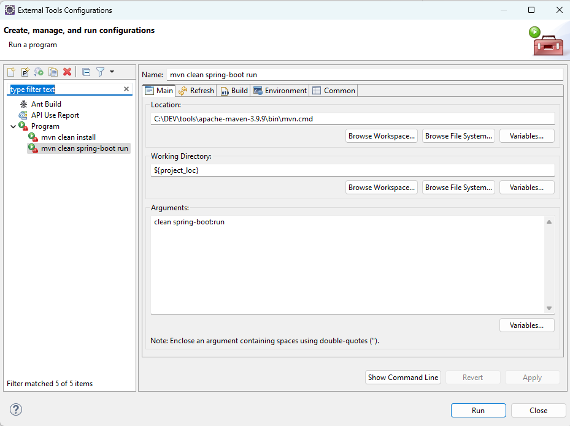

# Spring Boot

[Back to the main page](welcome_to_cambyze_wiki.md)

Main information about Spring Boot and useful annotations and commands for development and deployment.

## Table of Contents

- [Official links](#official-links)
- [Java annotations](#java-annotations)
- [Spring data JPA](#spring-data-jpa)
- [API versioning](#api-versioning)

---

## Official links
- [Spring Initializr](https://start.spring.io/) to initiate a maven project.
- [Building REST services with Spring](https://spring.io/guides/tutorials/rest).
- [Common application properties](https://docs.spring.io/spring-boot/how-to/properties-and-configuration.html) to be set in the ''application.properties'' file of the project.

Example:
```properties
server.port=9090
server.error.include-message=always
server.error.include-binding-errors=always
server.error.include-exception=true
spring.jpa.open-in-view=false

# Logging setting
logging.level.com.cambyze=DEBUG

# JSON conversion setting
spring.jackson.date-format=yyyy-MM-dd HH:mm:ss
spring.jackson.time-zone=Europe/Paris

# Configurations H2
spring.jpa.show-sql=true
spring.h2.console.enabled=false

#Encoding for data.sql
spring.datasource.sql-script-encoding=UTF-8
```
- Test the application with Maven (see also [there](https://docs.spring.io/spring-boot/maven-plugin/run.html))

```powershell
mvn clean spring-boot:run

[INFO] Scanning for projects...
[INFO]
[INFO] ----------------------< com.cambyze:finance-api >-----------------------
[INFO] Building finance-api 0.0.1-SNAPSHOT
[INFO]   from pom.xml
[INFO] --------------------------------[ war ]---------------------------------
[INFO]
[INFO] --- clean:3.4.0:clean (default-clean) @ finance-api ---
[INFO] Deleting C:\DEV\Projects\Git\cambyze-finance-api\target
[INFO]
[INFO] >>> spring-boot:3.4.2:run (default-cli) > test-compile @ finance-api >>>
[INFO]
[INFO] --- resources:3.3.1:resources (default-resources) @ finance-api ---
[INFO] Copying 1 resource from src\main\resources to target\classes
[INFO] Copying 0 resource from src\main\resources to target\classes
[INFO]
[INFO] --- compiler:3.13.0:compile (default-compile) @ finance-api ---
[INFO] Recompiling the module because of changed source code.
[INFO] Compiling 5 source files with javac [debug parameters release 17] to target\classes
[INFO]
[INFO] --- resources:3.3.1:testResources (default-testResources) @ finance-api ---
[INFO] skip non existing resourceDirectory C:\DEV\Projects\Git\cambyze-finance-api\src\test\resources
[INFO]
[INFO] --- compiler:3.13.0:testCompile (default-testCompile) @ finance-api ---
[INFO] Recompiling the module because of changed dependency.
[INFO] Compiling 1 source file with javac [debug parameters release 17] to target\test-classes
[INFO]
[INFO] <<< spring-boot:3.4.2:run (default-cli) < test-compile @ finance-api <<<
[INFO]
[INFO]
[INFO] --- spring-boot:3.4.2:run (default-cli) @ finance-api ---
[INFO] Attaching agents: []

  .   ____          _            __ _ _
 /\\ / ' __ _ () __  __ _ \ \ \ \
( ( )\__ | '_ | '| | ' \/ ` | \ \ \ \
 \\/  )| |)| | | | | || (| |  ) ) ) )
  '  || .__|| ||| |\, | / / / /
 =========||==============|/=///_/

 :: Spring Boot ::                (v3.4.2)

2025-02-06T18:57:50.692+01:00  INFO 3056 --- [finance-api] [           main] c.c.finance_api.FinanceApiApplication    : Starting FinanceApiApplication using Java 17.0.13 with PID 3056 (C:\DEV\Projects\Git\cambyze-finance-api\target\classes started by Admin in C:\DEV\Projects\Git\cambyze-finance-api)
2025-02-06T18:57:50.697+01:00  INFO 3056 --- [finance-api] [           main] c.c.finance_api.FinanceApiApplication    : No active profile set, falling back to 1 default profile: "default"
2025-02-06T18:57:52.105+01:00  INFO 3056 --- [finance-api] [           main] o.s.b.w.embedded.tomcat.TomcatWebServer  : Tomcat initialized with port 8080 (http)
2025-02-06T18:57:52.126+01:00  INFO 3056 --- [finance-api] [           main] o.apache.catalina.core.StandardService   : Starting service [Tomcat]
2025-02-06T18:57:52.126+01:00  INFO 3056 --- [finance-api] [           main] o.apache.catalina.core.StandardEngine    : Starting Servlet engine: [Apache Tomcat/10.1.34]
2025-02-06T18:57:52.204+01:00  INFO 3056 --- [finance-api] [           main] o.a.c.c.C.[Tomcat].[localhost].[/]       : Initializing Spring embedded WebApplicationContext
2025-02-06T18:57:52.206+01:00  INFO 3056 --- [finance-api] [           main] w.s.c.ServletWebServerApplicationContext : Root WebApplicationContext: initialization completed in 1428 ms
2025-02-06T18:57:52.367+01:00  INFO 3056 --- [finance-api] [           main] o.s.v.b.OptionalValidatorFactoryBean     : Failed to set up a Bean Validation provider: jakarta.validation.NoProviderFoundException: Unable to create a Configuration, because no Jakarta Bean Validation provider could be found. Add a provider like Hibernate Validator (RI) to your classpath.
2025-02-06T18:57:52.687+01:00  INFO 3056 --- [finance-api] [           main] o.s.b.w.embedded.tomcat.TomcatWebServer  : Tomcat started on port 8080 (http) with context path '/'
2025-02-06T18:57:52.700+01:00  INFO 3056 --- [finance-api] [           main] c.c.finance_api.FinanceApiApplication    : Started FinanceApiApplication in 2.646 seconds (process running for 3.103)
```
- Configure eclipse to launch maven for your current project:


## Java annotations
- Component, @Controller, @Service: to declare class to be  instantiated by Spring, see the official documentationExample:@Service
public class MicroserviceControllerServiceImpl implements MicroserviceControllerService {
Component,@Controller,@Service: to declare class to be  instantiated by Spring, see theofficial documentationExample:
[official documentation](https://docs.spring.io/spring-framework/docs/current/javadoc-api/org/springframework/stereotype/package-summary.html)
- @Autowired: to ask Spring to create an instance of class by using automatically the right implementation of the interface.Example:public class ProductController {
@Autowired
private ProductDao productDao;
@Autowired: to ask Spring to create an instance of class by using automatically the right implementation of the interface.Example:
- @SpringBootApplication is the same than @Configuration + @EnableAutoConfiguration + @ComponentScan
@SpringBootApplicationis the same than@Configuration+@EnableAutoConfiguration+@ComponentScan
To deploy on Tomcat server, the class must extendSpringBootServletInitializer
Example:
- @SpringBootTest, @AutoConfigureMockMvc : to create the Spring Boot test class for the API
@SpringBootTest, @AutoConfigureMockMvc: to create the Spring Boot test class for the API
Example:
- @RestController: to design the current class as a REST controller to manage GET/POST/... requests with JSON objects. To be used with:@RequestMapping, @GetMapping, @PostMapping...: annotations to map java methods with request methods.@PathVariable: to map with parameters of the URL@RequestBody to ask spring to convert the JSON containing in the request body into a java object.List of the official HTTP status codes to return
@RestController: to design the current class as a REST controller to manage GET/POST/... requests with JSON objects. To be used with:
- @RequestMapping, @GetMapping, @PostMapping...: annotations to map java methods with request methods.
@RequestMapping,@GetMapping,@PostMapping...:annotationsto map java methods withrequest methods.
[annotations](https://docs.spring.io/spring-framework/docs/current/javadoc-api/org/springframework/web/bind/annotation/package-summary.html)
[request methods](https://docs.spring.io/spring-framework/docs/current/javadoc-api/org/springframework/web/bind/annotation/RequestMethod.html)
- @PathVariable: to map with parameters of the URL
@PathVariable: to map with parameters of the URL
- @RequestBody to ask spring to convert the JSON containing in the request body into a java object.
@RequestBodyto ask spring to convert the JSON containing in the request body into a java object.
- List of the official HTTP status codes to return
List of the officialHTTP status codesto return
[HTTP status codes](https://www.iana.org/assignments/http-status-codes/http-status-codes.xhtml#http-status-codes-1)
Example:

About@Apiannotations, seehttps://cambyze.atlassian.net/wiki/spaces/Cambyze/pages/983115
[https://cambyze.atlassian.net/wiki/spaces/Cambyze/pages/983115](https://cambyze.atlassian.net/wiki/spaces/Cambyze/pages/983115)
- @Repository to indicate to Spring that the current class manages data (useful for errors translation, for instance).
@Repositoryto indicate to Spring that the current class manages data (useful for errors translation, for instance).
Example:
- @Entity, @Id, @GeneratedValue, @SequenceGenerator to declare to JPA a persistence entity with its internal id and to specify if its id is generated automatically or not. See the “Spring data JPA” section below.
@Entity,@Id,@GeneratedValue,@SequenceGeneratorto declare to JPA a persistence entity with its internal id and to specify if its id is generated automatically or not. See the “Spring data JPA” section below.
Example:
this code generates the following sequence and table:
- @ForeignKey, @IdClass: for foreign key or composite primary key class
@ForeignKey,@IdClass: for foreign key or composite primary key class
- @Index: to specify the creation of an index.
@Index: to specify the creation of an index.
- @PrePersist, @PreUpdate: methods to be launch before insert or update in the databaseExample:@Entity
public class Product {

...

/* Format code a upper case String */
private void formatProductCode() {
 if (this.code != null) {
 this.code = this.code.toUpperCase();
 }
}
/* Format received numbers as amounts */
private void formatProductAmounts() {
 if (this.price != null) {
 this.price = MathTools.roundWithDecimals(this.price, NBDECIMALS);
 }
 if (this.purchasePrice != null) {
 this.purchasePrice = MathTools.roundWithDecimals(this.purchasePrice, NBDECIMALS);
 }
}

 @PrePersist
 private void prePersist() {
 formatProductCode();
 formatProductAmounts();
 }

 @PreUpdate
 private void preUpate() {
 formatProductAmounts();
 }
@PrePersist,@PreUpdate: methods to be launch before insert or update in the databaseExample:
- @ManyToMany, @ManyToOne, @OneToMany, @OneToOne: to define the entities relationship
@ManyToMany, @ManyToOne,@OneToMany,@OneToOne: to define the entities relationship
Example: master table “account” with a operations, child table “operation”
NB: in its example, we assume there is no a lot of operations then for convenience we use the EAGER mode. Normally, it is better to use the LAZY mode.


- @EntityGraph, @NamedEntityGraph: to load the property of the entity eagerly, even though our entity declares a lazy-loading strategy for this property.Example of @NamedEntityGraph above , of @EntityGraph below :@Repository
public interface CharacteristicsDao extends JpaRepository<Characteristic, Long> {

@EntityGraph(attributePaths = {"item"})
Characteristic findByType(String type);
}
@EntityGraph, @NamedEntityGraph: to load the property of the entity eagerly, even though our entity declares a lazy-loading strategy for this property.Example of @NamedEntityGraph above , of @EntityGraph below :

- @Length, @Min, @Max, @NotNull, @NotBlank, @Email, @NotEmpty, @Range, @URL: to let java & hibernate validate the data.Example:
@Length,@Min,@Max,@NotNull,@NotBlank,@Email,@NotEmpty,@Range,@URL: to let java &hibernatevalidate the data.Example:
[hibernate](https://docs.jboss.org/hibernate/validator/5.1/api/org/hibernate/validator/constraints/package-summary.html)
- @Enumerated: to force an enumeration
@Enumerated: to force an enumeration
Example:
- @Valid: for cascade validation, it means that the object as the current object attribute has to be valid as well else the current object is not valid. See also there and there
@Valid: for cascade validation, it means that the object as the current object attribute has to be valid as well else the current object is not valid. See alsothereandthere
[there](https://docs.jboss.org/hibernate/annotations/3.4/reference/fr/html/validator.html)
[there](https://docs.jboss.org/hibernate/stable/validator/reference/en-US/html_single/#preface)
Example:
- more annotations
moreannotations
[annotations](https://jakarta.ee/specifications/persistence/2.2/apidocs/javax/persistence/package-summary.html)
- @Query: To build JPA queries, see the full documentation and the “Spring data JPA” section above.
@Query: To build JPA queries, see the fulldocumentationand the “Spring data JPA” section above.
[documentation](https://docs.spring.io/spring-data/jpa/reference/#jpa.query-methods.at-query)
- @JsonIgnore, @JsonFilter: to indicate that the attribute has not to be sent with the GET methods (static or dynamic filter)
@JsonIgnore,@JsonFilter: to indicate that the attribute has not to be sent with the GET methods (static or dynamic filter)
Example:


## Spring data JPA
To manage data persistence.
- See “java annotations” above.
See “java annotations” above.
- DAO method naming alows to have pre-implemented code, see the documentation, there and there.
DAO method naming alows to have pre-implemented code, see the documentation,thereandthere.
[there](https://docs.spring.io/spring-data/data-jpa/docs/1.1.x/reference/html/#jpa.query-methods.query-creation)
[there](https://docs.spring.io/spring-data/jpa/docs/current/reference/html/#jpa.query-methods)
Example:


## API versioning
The best practice is not to version API but if any moment it is required, the best way seems to use either a custom header or custom media types. See this [article](https://medium.com/@edgar/whats-the-best-strategy-for-versioning-a-restful-api-29b90dbbcf5f) and this [one](https://www.xmatters.com/blog/devops/blog-four-rest-api-versioning-strategies/#:~:text=A%20versioning%20strategy%20allows%20clients,to%20version%20a%20REST%20API.) for more information.

[Back to the main page](welcome_to_cambyze_wiki.md)